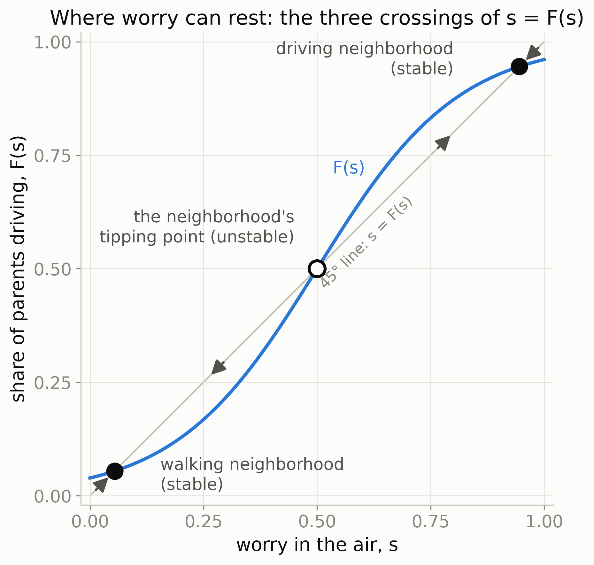
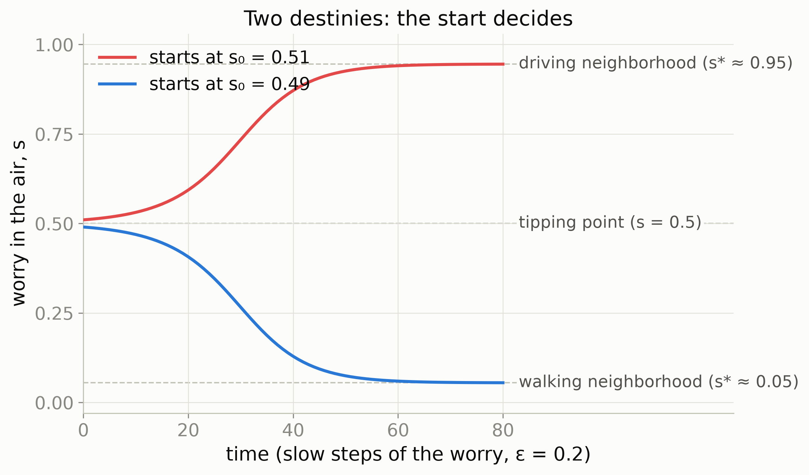
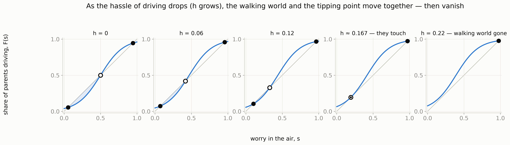
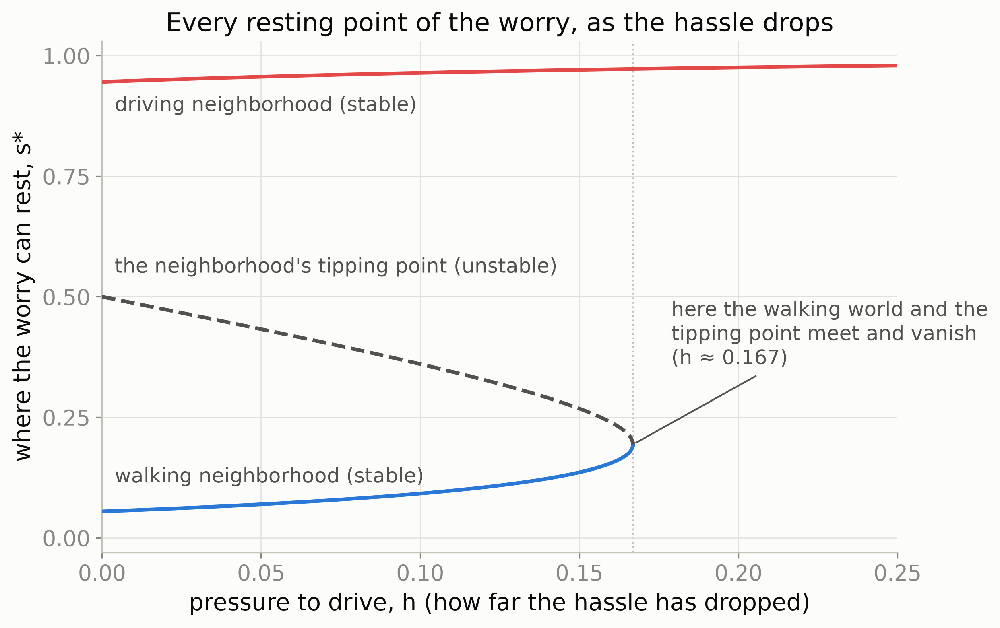
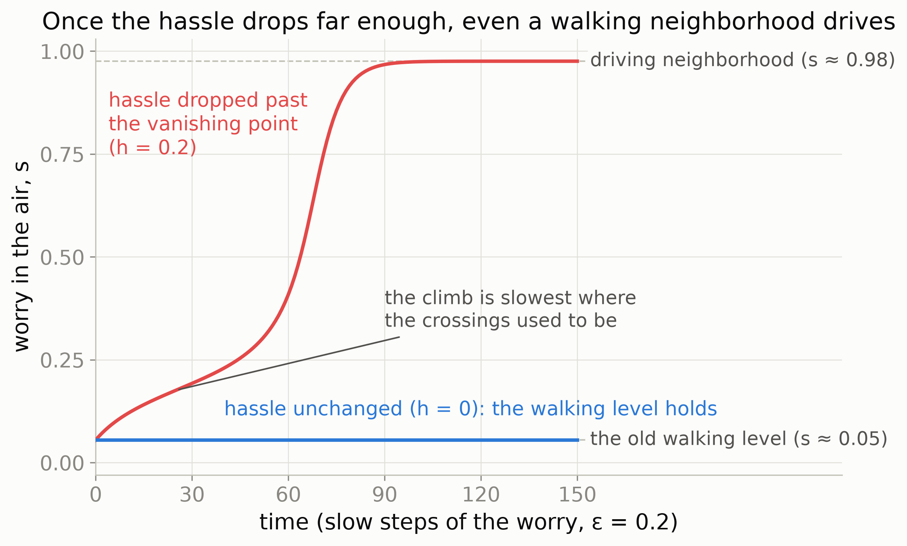

::: {.callout-note appearance="simple"}
**This report has two parts.** *Meeting Document* holds the agenda, my own thoughts, and the questions I want to confirm with Sensei. *Progress Report* holds the model itself: where it comes from, how every equation is derived, what the figures show, and the directions forward. All figures were generated by [plots.py](https://github.com/rizqrama/research_model_toy_two-worlds-problem/blob/main/plots.py) in the model repository, and the code validates four hand-computed experiments before drawing anything.
:::

## Meeting Document

### 1. What I want to discuss today

1. **Direction check.** On June 16 we agreed to "zoom out" from proving that emotional and relational factors exist in PUDO trips toward how such factors reshape household travel demand modeling. My reading of that direction produced a concrete first artifact: a model where a belief circulating in a neighborhood (the "worry in the air") and the households' visible choices feed each other on two timescales. I want to confirm that this is the concretization Sensei had in mind before I deepen it.

2. **Which direction next.** The model now stands on its own, with code, figures, and a full by-hand derivation. Three directions open from here, and I cannot rank them alone: (a) the collective-household literature (Chiappori 1988), since Brock and Durlauf assume a single decision-maker, which is effectively a *unitary* household, and the open question is how to make the household decision genuinely collective; (b) the emotional factor, which enters through the individual parameters, closeness lowering the hassle $c$ and felt obligation raising the push $b$, bringing PUDO's emotional and relational side inside the model; (c) the neural-network ancestry, kept as background reading only.

### 2. My Own Thoughts

::: {.panel-tabset}

#### Presentation

| Discussion item | Current position | Main alternative considered |
|---|---|---|
| Direction check | The model makes the belief environment itself endogenous. Preferences respond to the neighborhood, and the neighborhood is made of past choices | Entering through the collective-household literature directly, before any working mechanism |
| Which direction next | The collective-household bridge feels closest to the dissertation core, because Brock and Durlauf's single decider is really a unitary household, and PUDO is precisely about the household interior | Leading instead with the emotional factor (parameters $b$ and $c$), or keeping the NN ancestry as bounded background reading |

#### Detailed

- **On discussion item 1 (direction check)**
    - **Current thought:** The model is my honest reading of "zoom out". Instead of adding emotion as one more variable inside a fixed-preference model, it makes the belief environment itself endogenous, so preferences respond to the neighborhood and the neighborhood is made of past choices.
    - **Reasoning:** The June 16 discussion pointed from *proving* non-unitary behavior toward *modeling consequences* for demand. A mechanism where indistinguishable neighborhoods (worry 0.49 vs 0.51) end in opposite worlds is a consequence no fixed-preference model can produce, and it is directly relevant to school-run PUDO trips.
    - **Alternatives I considered:** staying with the survey instrument first (set aside per the June direction), or entering through the collective-household literature directly. I felt I needed a working mechanical picture before the household interior.

- **On discussion item 2 (which direction next)**
    - **Current thought:** The collective-household bridge feels closest to the dissertation core. Brock and Durlauf assume one decision-maker per household, which is a unitary model, and my dissertation is precisely about the household interior. The direction is to let the escort decision emerge from bargaining between members rather than from a single utility.
    - **Reasoning:** That would connect the two halves of my Year-1 work: the household interior (collective models, PUDO as unpaid work) and the neighborhood exterior (social interactions). The interaction between the two levels, negotiation inside and conformity outside, is where I suspect the novelty lives.
    - **Alternatives I considered:** leading with the emotional factor instead, since closeness and obligation map cleanly onto the parameters $c$ and $b$ and tie back to the emotional-relational thread; or the neural-network ancestry, which is interesting but background, one bounded reading block rather than a research direction.

:::

### 3. Things I Want to Confirm {#sec-confirm}

::: {.callout-important appearance="simple"}
**Questions for Sensei**

1. Is the school-run story an acceptable framing for the lab presentation, or should I keep the PUDO terminology in the foreground throughout?
2. Is "Granovetter plus a slow layer" a fair one-line statement of what the model adds, or am I overclaiming?
3. The two-worlds behavior needs the middle crossing to be fragile, which requires $\beta J > 1$ (decisive enough parents, strong enough neighbor tug). Is it right to emphasize this condition as *the* empirically interesting question, whether real neighborhoods sit above or below it?
:::

### 4. What I did since the last meeting

- Built and validated a deterministic model ("two-worlds school-run model") in Python: every parent drives when their worry-push beats their hassle, the neighborhood share feeds a slowly-drifting worry, and the same neighborhood ends in different destinies depending only on its starting mood. Code, figures, and a guided walkthrough: [research_model_toy_two-worlds-problem](https://github.com/rizqrama/research_model_toy_two-worlds-problem).
- Completed the derivation by hand. I can reproduce the whole chain on blank paper, from one parent's rule to the tanh self-consistency equation of Brock and Durlauf (2001), including my own derivation of the double role of the average choice $m$.
- Located the model against Granovetter (1978). His threshold model has the cumulative curve and the equilibrium diagram; the model here adds the slow layer, a worry *made of* past behavior that drifts between morning decisions.
- Produced the figure set (plots A to E), including the disappearance of the walking equilibrium at a critical pressure $h_c \approx 0.167$.

### 5. Where I Am Stuck / What I Cannot Decide on My Own

::: {.callout-warning appearance="simple"}
- **No clear criterion** for ranking the collective-household bridge (making the household decision collective) against the emotional-factor bridge (emotion entering through $b$ and $c$). Both feel necessary; I cannot see which one the dissertation timeline needs first.
- **The step to data feels far.** Whichever bridge I take, separating the social tug from correlated unobservables is a known hard problem in social-interactions econometrics. I do not yet know its shape well enough to plan around it, and I would like guidance on what to read before designing anything empirical.
:::

### 6. Definitions of Terms

| Term | Definition |
|------|------------|
| Worry level $s$ | The pro-driving mood circulating in the neighborhood, measured on the share scale, $s \in [0,1]$. Deliberately measured as a share so it can be compared with actual behavior. |
| Personal tipping point $c/b$ | The worry level above which one parent drives. $b$ is the parent's sensitivity to the worry, $c$ their hassle of driving; only the ratio matters. |
| $F(s)$ | The share of parents whose tipping point lies below $s$, equivalently the share who drive when the worry is $s$. A cumulative count, S-shaped when tipping points are spread out; it can never decrease. |
| Gap $G(s) = F(s) - s$ | What the street delivers minus what the air expects. A positive gap raises the worry; a negative gap cools it. |
| Resting point | A worry level where $F(s) = s$: the street confirms the expectation, so nothing moves. *Solid* (stable) where the curve cuts the 45° line from above; *fragile* (unstable) where it cuts from below. |
| Margin $m$ | The same information as $s$ on a second scale: $m = 2s - 1 \in [-1, +1]$, how far ahead driving is over walking. |
| $\beta$ | Decisiveness: how reliably a parent follows the net push, versus morning-to-morning randomness. $1/\beta$ plays the role of temperature in the magnet analogy. |
| $J$ | The neighbor tug: how strongly others' average choice pushes one's own. |
| $h$ | Outside pressure pushing everyone the same way (media, norms, policy). It acts exactly like a discount on everyone's hassle. |
| $h_c$ | The critical pressure at which the walking resting point and the neighborhood's tipping point merge and vanish ($\approx 0.167$ for the seminar curve). |
| Fast / slow layer | Mornings: given today's worry, parents settle immediately (inside $F$). Weeks: the worry itself drifts by the gap rule. |

## Progress Report

### 1. Circulating beliefs shape how we travel, yet standard models hold them fixed

Humans are social beings. We interact, watch, and talk, and as a result our behavior, including how we travel, often takes shape as a response to the beliefs circulating around us. Standard travel-demand models miss this almost by construction: they treat each person's preferences and beliefs as fixed numbers set from outside the model, estimated once and then held still.

The school run makes the gap concrete. In a neighborhood of young parents, whether a parent *drives their child to school* or *lets the child go alone* depends partly on a belief in the air, "is it safe to let kids go alone?", and that belief is itself shaped by what other parents do and say, social media included. The school run is also a picking-up and drop-off (PUDO) trip, the unpaid mobility work at the center of this dissertation, so a model of how such beliefs and choices feed each other speaks directly to the main research theme.

### 2. Physics offers a working picture: the neighborhood as a magnet

::: {.panel-tabset}

#### Presentation

| magnet world | school-run world |
|---|---|
| one tiny magnet (spin) | one household |
| direction of the spin | the decision (drive or not), not the preference |
| neighbor tug, strength $J$ | the choices of the neighbors |
| external field $h$ | norms, policy, media |
| heat kicks (temperature $= 1/\beta$) | random personal shocks (the punctured tire) |
| magnetization $m^*$ | the self-consistent average choice |

```{mermaid}
%%| label: fig-magnet-analogy
%%| fig-alt: "Two-panel analogy diagram. Left panel, the magnet: each spin aligns with its neighbors, an external field pulls every spin the same way, and heat kicks randomize individual spins. Right panel, the school-run neighborhood: each parent conforms to the average choice of the neighborhood, norms and media and policy push every parent the same way, and random personal shocks perturb individual mornings. A dotted arrow labeled same mathematics connects the two panels."
flowchart LR
    accTitle: The magnet and the school-run neighborhood obey the same mathematics
    accDescr {
        Two-panel analogy. Left, the magnet: each spin aligns with neighbors, an external field pulls everyone, heat kicks randomize. Right, the school-run neighborhood: each parent conforms to the average choice, norms and media push everyone, personal shocks perturb mornings. A dotted arrow marks that the same mathematics governs both.
    }
    subgraph M["Magnet"]
        S1["spin aligns<br/>with neighbors"] --> S2["external field h<br/>pulls everyone"]
        S2 --> S3["heat kicks<br/>randomize"]
    end
    subgraph N["School-run neighborhood"]
        P1["parent conforms to<br/>the average choice"] --> P2["norms, media, policy<br/>push everyone"]
        P2 --> P3["personal shocks<br/>(the punctured tire)"]
    end
    M -. "same mathematics" .-> N

    classDef concept fill:#1f2d2a,stroke:#3a5a4a,stroke-width:2px,color:#f0e4cf
    classDef output fill:#4a3a2a,stroke:#c0a87f,stroke-width:1.5px,color:#f0e4cf
    class S1,S2,S3 concept
    class P1,P2,P3 output
```

#### Detailed

The inspiration comes from Philip Ball's argument that human social systems, viewed collectively, can mimic how nature behaves, and nature is usually described with physics. Social systems, he writes, display "collective dynamics that changes via abrupt shifts (phase transitions), metastability, critical phenomena" (Ball, 2003, p. 190); he also passes on Herbert Simon's claim that the social sciences are in fact "the hardest sciences", the most complex, with rules that can change adaptively over time (p. 191). The point is not that people are particles; it is that some collective patterns do not care much about the details of their parts.

The specific picture is a magnet. A piece of iron is a crowd of tiny magnets (spins), each trying to align with its neighbors while heat kicks it around and an external field pulls at everyone. The neighborhood reads the same way: each household is a spin, its *decision* (not its preference) is the spin's direction, the neighbor tug is the choices of the surrounding households, the external field is norms and media and policy, and the heat kicks are random personal shocks, the punctured tire that changes today's choice without changing the underlying preference.

:::

### 3. Brock and Durlauf give the picture an economic backbone

Brock and Durlauf (2001) asked exactly the question the magnet poses: if each person slightly prefers to match the people around them, what does the group as a whole end up doing, and can more than one outcome be stable? In their framework, each individual's utility has three parts: a private taste for the choice itself, a social part that rewards matching what others are expected to choose, and a random shock. The social part runs on a *belief*: one does not observe each neighbor's decision in advance, only an expected average choice of others. Interactions can be local (a few named neighbors) or global (comparison to a neighborhood average); their paper, and this model, work with the global kind. Equilibrium is the situation where beliefs turn out to be correct, so the average people expected is the average their own choices then produce. The model borrows this whole skeleton and nothing more; no equations from the paper are needed beyond what the derivation below rebuilds.

### 4. The conceptual framework: two layers on two timescales

```{mermaid}
%%| label: fig-framework
%%| fig-alt: "Feedback-loop diagram of the model. The worry in the air, s, feeds the morning decision rule drive if and only if b times s plus h exceeds c, producing today's driving share F of s. The driving share feeds back into the worry through the slow update rule: s moves a small step epsilon toward F of s. Outside pressure h enters the worry side; the hassle c enters the decision side. The loop settles at resting points where F of s equals s: the walking world, the neighborhood tipping point, and the driving world. Sufficient pressure or cheaper driving erases the walking world at a critical pressure of about 0.167."
flowchart TB
    accTitle: The two-layer feedback loop of the school-run model
    accDescr {
        The worry in the air feeds the fast morning decision rule, which produces today's driving share. The share feeds back into the worry through the slow epsilon update. Outside pressure enters the worry side; the hassle enters the decision side. The loop rests where the curve F of s equals s, giving the walking world, the tipping point, and the driving world; enough pressure or cheaper driving erases the walking world.
    }
    W["worry in the air s<br/>(expected share driving)"] -->|"fast layer, mornings:<br/>drive iff b·s + h > c"| D["today's driving share F(s)"]
    D -->|"slow layer, weeks:<br/>s ← s + ε·(F(s) − s)"| W
    H["outside pressure h<br/>(norms, media, policy)"] --> W
    C["hassle c<br/>(infrastructure, service design)"] --> D
    D --> R["resting points: F(s) = s<br/>walking world · tipping point · driving world"]
    R --> V["pressure or cheaper driving<br/>can erase the walking world<br/>(h_c ≈ 0.167)"]

    classDef concept fill:#1f2d2a,stroke:#3a5a4a,stroke-width:2px,color:#f0e4cf
    classDef output fill:#4a3a2a,stroke:#c0a87f,stroke-width:1.5px,color:#f0e4cf
    class W,D,H,C concept
    class R,V output
```

The two arrows between worry and street are the heart of it. The fast layer is the morning: given today's worry, parents settle immediately. The slow layer is the span of weeks: the worry drifts a small step $\varepsilon$ toward what the street shows. Everything else in the model is bookkeeping around this loop.

### 5. The model, from one parent's rule to two destinies

::: {.panel-tabset}

#### Presentation

**The chain in one line:** one parent's rule, then the personal tipping point, then counting the street $F(s)$, then the worry moving by the gap, then rest at $F(s)=s$ with three crossings, then outside pressure sliding the curve left, then the walking world vanishing.

- **Assumptions first** (they carry the equations): everyone holds a belief about the *average* choice of others, not per-neighbor predictions; decisions are simultaneous, with incomplete information, so only after driving does the street reveal the realization; the worry $s$ is measured as a share on purpose, so expectation and realization share one scale.
- **One parent:** drives when $b \cdot s > c$, that is, when $s > c/b$. One number, the tipping point, captures the whole parent.
- **The street:** $F(s)$ is the share of parents whose tipping point is below $s$. A staircase for five parents, an S-curve for hundreds, and it never decreases. The same $s$ plays three roles: worry level, measurable share, and threshold ("I will drive if $x$ out of $y$ people drive").
- **The slow layer:** $s_{t+1} = s_t + \varepsilon\,(F(s_t) - s_t)$, with $\varepsilon = 0.2$ in the figures.
- **Rest:** $F(s) = s$, three crossings at $s^* \approx 0.055$, $0.500$, and $0.945$; stable where the curve cuts the line from above, fragile where it cuts from below.
- **Pressure:** $b \cdot s + h > c \iff s > (c-h)/b$, so pressure is a hassle discount; the curve slides left by $h/2$, and at $h_c \approx 0.167$ the walking world vanishes.
- **The tanh bridge:** $m = 2s - 1$; the expected margin under push $u$ works out to $\tanh(u)$; rest becomes $m = \tanh(\beta(h + Jm))$, the same statement as $F(s)=s$ in margin units.

{#fig-plot-a fig-alt="The S-shaped curve F of s plotted against the 45-degree line, crossing it three times: near 0.055, at 0.5, and near 0.945. Arrows along the diagonal show worry drifting away from the middle crossing toward the outer two."}

{#fig-plot-b fig-alt="Two trajectories of worry over time from starting values 0.49 and 0.51. The lower one descends to about 0.055, the upper one climbs to about 0.945, showing motion slowest near resting points."}

{#fig-plot-c fig-alt="Five panels showing the S-curve sliding left as pressure h increases from 0 to 0.22. The shaded region between curve and diagonal shrinks and disappears at h approximately 0.167."}

{#fig-plot-d fig-alt="Resting worry levels plotted against pressure h. A solid walking branch and a dashed unstable branch curve toward each other and merge at h approximately 0.167; a nearly flat driving branch sits near 0.95."}

{#fig-plot-e fig-alt="Two worry trajectories from the same low start. At zero pressure the trajectory stays flat; at pressure 0.20 it climbs in an S-shaped path to the driving world, slowest where the crossings used to be."}

#### Detailed

**The assumptions come first, because they carry the equations.** Following Brock and Durlauf: everyone holds a belief about what others are going to do, not a prediction of each named neighbor, but an expected average choice. Decisions are made in an instant and in parallel, so no one has complete information about what each neighbor will choose; the feeling is "it seems people will drive today", and only after driving does the street reveal the realization. The worry $s$ is measured as a share on purpose, so that expectation and realization live on the same scale and can be compared.

**One parent.** On a given morning, a parent feels a push toward driving, the worry in the air $s$ times their personal sensitivity $b$, set against a hassle $c$. They drive exactly when $b \cdot s > c$, that is, when $s > c/b$. One number, the personal tipping point $c/b$, captures the whole parent; $b$ and $c$ never matter separately, only their ratio.

**The street.** $F(s)$ is the share of parents whose tipping point sits below $s$, equivalently the share driving when the worry is $s$. With five parents it is a staircase; with hundreds it smooths into an S-shaped curve that can never go down. Note the multiple roles the same number $s$ now plays: it is the worry level, it is a measurable share of people, and through $F$ it acts as a threshold, "I will drive if $x$ out of $y$ people drive".

**The slow layer.** The worry answers the street: $s_{t+1} = s_t + \varepsilon\,(F(s_t) - s_t)$, with $\varepsilon$ small ($0.2$ in the figures). The gap $F(s) - s$ is what the street shows minus what the air expects. Two speeds must not blur: the morning decision is already inside $F$ (fast); the worry's drift is the $\varepsilon$-rule (slow).

**Rest, and three crossings.** Worry stands still where $F(s) = s$, on the picture where the S-curve crosses the 45° line (@fig-plot-a). A crossing must exist: the curve starts above the line (some parents always drive) and ends below it (some never do), and a curve with no jumps must cross. For the seminar parameters ($\beta = 1.6$, $h = 0$, $J = 1$) there are three crossings: the walking world ($s \approx 0.055$), the driving world ($s \approx 0.945$), and between them the neighborhood's tipping point ($s = 0.5$). The nudge test separates them: where the curve cuts the line from above, nudges die out (stable); where it cuts from below, nudges feed themselves (fragile). @fig-plot-b shows the consequence: two neighborhoods starting at worry 0.49 and 0.51, indistinguishable to any survey, end in different worlds.

**Pressure, and the vanishing.** An outside push $h$ toward driving enters the rule as $b \cdot s + h > c$, which rearranges to $s > (c-h)/b$: pressure acts exactly like a discount on everyone's hassle and slides every tipping point, hence the whole curve, to the left by $h/2$ for the seminar curve. Between the walking world and the tipping point the curve runs below the line, and that below-the-line stretch is the room the walking world lives in; sliding left shrinks it one for one. At $h_c \approx 0.167$ the walking crossing and the tipping point merge and vanish (@fig-plot-c, @fig-plot-d), and past that the worry has nowhere to rest but the driving world (@fig-plot-e). The same erasure can come through $c$, since a drop-off lane lowers everyone's hassle, so an equilibrium can be killed through the field or through the curve.

**The margin bridge, and where tanh comes from.** The magnet tradition measures the street not by the share $s$ but by the margin $m$, how far ahead driving is over walking. The two facts "shares sum to one" and "their difference is the margin" give the only conversion needed: $m = 2s - 1$, and back $s = (m+1)/2$. The margin has a double role that I verified by hand: $m$ as the *margin between camps* ($s_{\text{drive}} - s_{\text{walk}}$) and $m$ as the *expected average choice* (the probability-weighted average of the $+1$ and $-1$ choices) are the same number. For parents whose mornings vary, the standard exponential-weight recipe gives $P(\text{drive}) = e^u / (e^u + e^{-u})$ under total push $u = \beta(h + J m)$; the expected margin $2P - 1$ then simplifies, in three lines of algebra, to $(e^u - e^{-u})/(e^u + e^{-u})$, which is exactly $\tanh(u)$. So tanh is not something extra: it is the expected margin under push $u$, written short. Writing rest on the margin scale turns $F(s) = s$ into the Brock and Durlauf self-consistency equation $m = \tanh(\beta(h + Jm))$; the famous equation and the 45°-line picture are the same statement in two notations.

**A note on the mathematical mindset.** The recurring move in the whole derivation is to *create a condition where two things are set equal* and read off what it implies. The crossings come from setting the curve equal to the line ($F(s) = s$); the slide of the curve comes from asking at which new worry a parent feels the same push as before ($h + J(2s_{\text{new}} - 1) = J(2s_{\text{old}} - 1)$, giving $s_{\text{new}} = s_{\text{old}} - h/2J$). Learning to ask "what if these two are equal?" before knowing why turned out to be the productive habit.

:::

### 6. The code implements exactly these equations, and checks itself by hand first

The repository ([research_model_toy_two-worlds-problem](https://github.com/rizqrama/research_model_toy_two-worlds-problem)) is deliberately small: numpy and matplotlib only, deterministic, no seeds. [model.py](https://github.com/rizqrama/research_model_toy_two-worlds-problem/blob/main/model.py) has five functions, each tied to one equation of the story. `F(s, beta, h)` is the three-step share to margin to share recipe; `drift` is the $\varepsilon$-rule; `find_crossings` scans for $F(s) = s$ and classifies stable or fragile by the local steepness; `h_critical` searches for the pressure where the walking world vanishes; `iterate_map` mechanizes the hand-iteration notebook. Before drawing anything, `validate()` reproduces four hand-computed experiments to machine precision, and a guided tour of every function is in [code_walkthrough.md](https://github.com/rizqrama/research_model_toy_two-worlds-problem/blob/main/code_walkthrough.md).

| experiment | $\beta$ | $h$ | $m_0$ | hand result | code |
|---|---|---|---|---|---|
| (i) hot iron | 0.01 | 0.5 | any | ≈ +0.00505 | +0.005050 |
| (ii) cold, start high | 10 | 0.5 | +0.9 | ≈ +0.99999 | +1.000000 |
| (iii) cold, start low | 10 | 0.5 | −0.9 | ≈ −0.9999 (holds *against* the field) | −0.999909 |
| (iv) field destroys | 10 | 2.0 | −0.9 | ≈ +1 | +1.000000 |

Experiments (ii) and (iii) are the two destinies in miniature: same ingredients, opposite worlds, and the start decides.

### 7. Three directions forward

::: {.panel-tabset}

#### Presentation

| Direction | The idea |
|---|---|
| Collective household (Chiappori 1988) | Brock and Durlauf assume an individual decision-maker, which is really a *unitary* household. The direction is to model the household as a *collective*, with the escort decision negotiated between members rather than set by one utility. |
| Emotional factor | Emotion enters through the individual parameters: closeness lowers the hassle $c$, felt obligation raises the push $b$. A stronger bond makes a parent readier to drive, which is where PUDO's emotional and relational side enters the model. |
| Neural-network ancestry | tanh is a rescaled sigmoid, and the Ising magnet, Brock and Durlauf, and Hopfield networks are one family. Worth keeping as background literacy for now. |

#### Detailed

**Collective household (Chiappori 1988).** Brock and Durlauf model an individual decision-maker who responds to the neighborhood. For a household that is effectively a *unitary* model, one utility standing in for the whole home. The direction is to make the household decision genuinely collective: the escort trip is negotiated between members, so who drives, whose time is counted, and how bargaining power is distributed all shape the choice. This connects the neighborhood exterior (conformity) to the household interior (negotiation), the two halves of my Year-1 reading.

**Emotional factor.** The toy leaves each parent's sensitivity $b$ and hassle $c$ as given numbers. The emotional and relational side of PUDO is where those numbers come from: closeness to the child lowers the felt hassle $c$, and a felt obligation raises the push $b$, so a stronger bond makes a parent readier to drive. Bringing emotion in through $b$ and $c$ keeps it inside the same mechanism rather than bolted on, and it reconnects the model to the emotional-first narrative the dissertation started from.

**The neural-network ancestry.** The tanh curve here and the sigmoid activation in neural networks are the same curve rescaled ($\tanh(x) = 2\sigma(2x) - 1$), and the lineage is real, not visual: Hopfield networks and Boltzmann machines are Ising and spin models with learning, the same family Brock and Durlauf borrowed from. One family tree runs from the magnet to social-interaction choice models to neural networks. I have reserved one bounded reading block for this and treat it as background literacy, not a research direction.

:::

## References

- Ball, P. (2003). The physical modelling of human social systems. *Complexus*, 1(4), 190–206.
- Brock, W. A., & Durlauf, S. N. (2001). Discrete choice with social interactions. *The Review of Economic Studies*, 68(2), 235–260.
- Chiappori, P.-A. (1988). Rational household labor supply. *Econometrica*, 56(1), 63–90.
- Granovetter, M. (1978). Threshold models of collective behavior. *American Journal of Sociology*, 83(6), 1420–1443.

## Appendix: source code map

| Result | Link to code | Notes |
|--------|--------------|-------|
| Plot A, the 45° picture, three crossings | [plots.py](https://github.com/rizqrama/research_model_toy_two-worlds-problem/blob/main/plots.py) (`plot_a`) | $\beta = 1.6$, $h = 0$, $J = 1$; crossings at $s^* \approx 0.055 / 0.500 / 0.945$ |
| Plot B, two destinies | [plots.py](https://github.com/rizqrama/research_model_toy_two-worlds-problem/blob/main/plots.py) (`plot_b`) | starts $s_0 = 0.49$ vs $0.51$; $\varepsilon = 0.2$ |
| Plot C, the vanishing step by step | [plots.py](https://github.com/rizqrama/research_model_toy_two-worlds-problem/blob/main/plots.py) (`plot_c`) | five pressure snapshots $h = 0 \to 0.22$ |
| Plot D, resting points vs pressure | [plots.py](https://github.com/rizqrama/research_model_toy_two-worlds-problem/blob/main/plots.py) (`plot_d`) | branches meet at $h_c \approx 0.167$ |
| Plot E, after the vanishing | [plots.py](https://github.com/rizqrama/research_model_toy_two-worlds-problem/blob/main/plots.py) (`plot_e`) | $h = 0$ holds forever; $h = 0.20 > h_c$ climbs away |
| Validation (four hand experiments) | [model.py](https://github.com/rizqrama/research_model_toy_two-worlds-problem/blob/main/model.py) (`validate`) | matches hand iteration of $m \leftarrow \tanh(\beta(h + Jm))$ |
